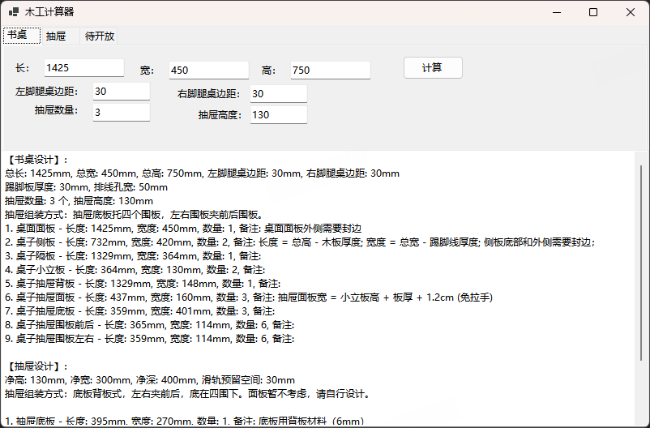

# woodworker

木工计算器

# 书桌

1. 桌面面板是直接盖在上面的，无须固定，方便后期组装抽屉。

2. 两块侧板做支撑腿，左右可以预留空间给靠墙的踢脚板预留，可以预留电脑机箱位置。

3. 下面做一排免拉手的抽屉。

4. 靠墙可以预留空间给插线。

# 抽屉

两种方案：底板背板式、底板内嵌式。暂不考虑抽屉面板的情况，抽屉安装好后后面再设计，因为要考虑全盖半盖还是免拉手。

## 底板背板式（小白推荐，简单易行）

也就是柜子的组装方式，相当于一个躺倒的小型柜体。

优点是制作方便，缺点：从左右侧边可以看到底板的边沿，但是一般也留意不到，不追求极致的其实无所谓。

抽屉组装方式：底板背板式，左右夹前后，底在四围下。

- 封边情况：四围顶端；

- 固定方式：F30直钉直接固定四围及背板即可。

## 底板内嵌式

抽屉组装方式：底板内嵌式，左右夹前后，底被四围夹。

这种一般厂家制作的抽屉是这种形式，优点是底板内嵌不需要打钉，左右侧边也看不到底板外露。

个人手工暂不推荐，费时费力。
